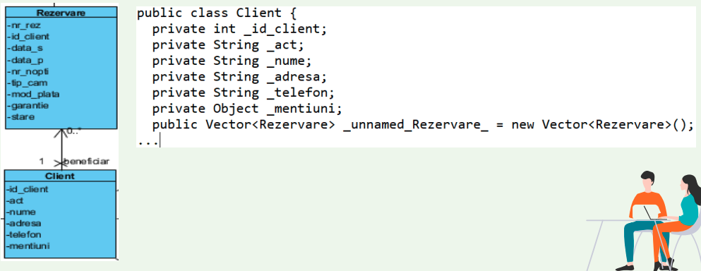

# Proiectarea

- Se parcurg pe rand cazurile de utilizare

- Se aleg clasele domeniului care sunt implicate in cazul de utilizare

- Se adauga noi clase in functie de specificul implementarii

- Se adauga o clasa controller care sa fie responsabila pentru cazul de utilizare

- Se determina cerintele de vizibilitate a navigarii

- Se completeaza atributele fiecarei clase cu vizibilitate si tip

- Se identifica responsabilitatile fiecarei clase si se completeaza metodele specifice

## Clase stereotip

1. Entitate

- <<entity>>

- O clasa pasivam care nu initiaza interactiuni

2. Control

- <<control>>

- Initiaza interactiuni, contine o componenta tranzactionala si este separator intre entitati si linmite

3. Limita <<boundary>>

- La periferia sistemului (deci in exteriorul sistemului)

## Vizibilitatea navigarii

- Abilitatea unui obiect de a vedea si interactiona cu alt obiect

- Se realizeaza prin adaugarea intr-o clasa a unei referinte la obiect

## Metoda claselor

- Se poate folosi tehnica **CRC - Class, Responsability, Collaboration**

- Care sunt responsabilitatile unei clase? Cum colaboreaza cu alte clase pentru a realiza un caz de utilizare?

- Se pot folosi diagramele de secventa detaliate - fiecare mesaj receptionat de un obiect al unei clase trebuie sa aiba in corespondenta o metoda in clasa respectiva

## Protectia in fata schimbarii

- Un principiu al proiectarii este de a separa partile care sunt stabile de partile care sufera numeroase schimbari

- Conexiunea la baza de date si logica SQL se pastreaza in clase separate de logica aplicatiei

- Se utilizeaza clase adaptor care se pot schimba pentru interactiunea cu alte sisteme

## Implementarea relatiilor de agregare

1. Agregarea partajata

- Se realizeaza prin referinta

- Agregarea partajata: un obiect va contine doar o referinta la al doilea obiect

2. Agregarea compusa

- Se realizeaza prin valoare

- O copie a obiectului agregat se stocheaza prin valoarea

## Implementarea relatiilor de generalizare

- O subclasa mosteneste dintr-o superclasa trei elemente specifice: atribute, operatii si relatii

- Exemplu: Avem 3 tipuri de plati: Card, Cash, Banca. Toate extind atributele clasei Plata. Apare un comportament de polimorfism

# Proiectarea bazei de date

- Se pleaca de la modelul claselor domeniului

- Se alege structura bazei de date: relationala, orientata obiect, tip graf, etc.

## Maparea obiectelor domeniului pentru SGBDR

1. Maparea tuturor claselor concrete ale domeniului in tabele

2. Mapam atributele cu valoare unica in coloane ale tabelei

3. Mapam procedurile

4. Mapam agregarile

**OBS:**

- Pentru relatiile de agregare si asociere tip mixt, copiem cheia primara din partea 1 a relatiei intr-o coloana noua in tabela aferenta laturii multi a relatiei

# Proiectarea interfetei cu utilizatorul

1. Investigarea asteptarii actorilor asupra interfetei

2. Prototipizarea

- stabilirea cerintelor interfetei

- valdiarea cerintelor proiectului

- inceperea etapei de dezvoltare a elementelor standard ale interfetei
