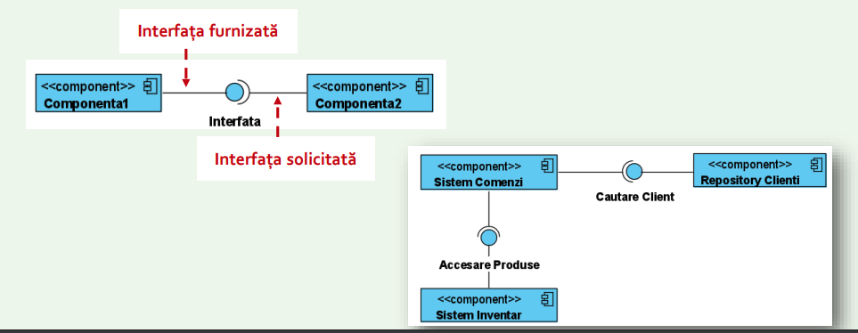

# Diagrama de componente

- Prezinta dependintele existente intre diverse componente software

- Avem dependente **statice** (au loc la compilare / link-editare) sau **dinamice** (in timpul executiei)

- Modeleaza arhitectura de ansamblu si componentele locale

- Include componentele sistemului si interfetele

## Componenta

- Este un fisier, modul software sau program executabil cu interfata bine definita

- La nivel inalt de abstractizare, componentele sunt unitati autonome incapsulate intr-un sistem sau subsistem care furnizeaza una sau mai multe componente

## Interfata

- Specifica un contract constand dintr-un set de atribute si operatii publice pentru o clasa

- Avem 2 tipuri de interfete ale componentelor:

1. Furnizata - oferita de catre componenta, se reprezinta cu un cerc

2. Solicitate - necesara componentei, se reprezinta cu un semicerc

## Portul

- Sunt reprezentate folosind un patrat de-a lungul marginii unei componente

- Este o fereastra explicita

- Un port furnizeaza sau necesita una sau mai multe interfete specifice

# Diagrama de desfasurare

- Reprezinta relatiile dintre componentele hardware

- Se bazeaza pe noduri (dispozitive sau medii de executie)
