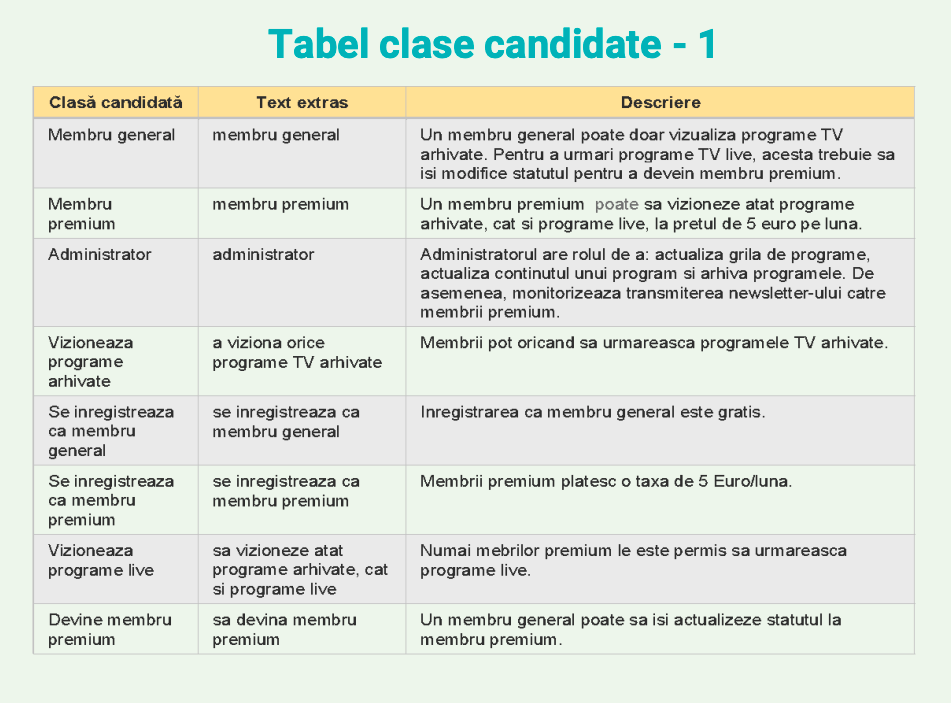
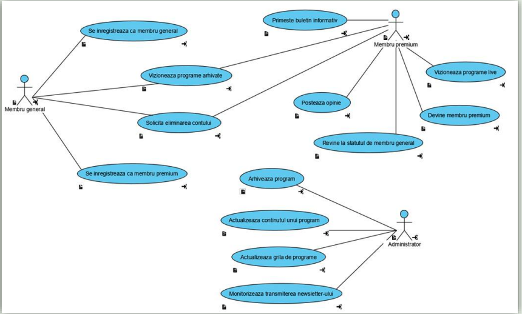
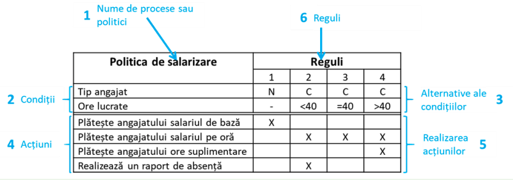

# Cerintele sistemului informatic

## Identificarea cerintelor

- Procesul prin care culegem si documentam cerintele sistemului

- Cu cat descoperim mai multe cerinte, cu atat sistemul construit va fi mai bun

- Cerintele se schimba

- Cerintele sunt _explicite_ (furnizate de beneficiar) sau _implicite_ (descoperite de analist)

## Artefactele

- Contin orice informatie despre sistem care poate fi culeasa din diverse surse: documente preexistente, esantioane de date, chestionare, scenarii, legislatie

## Analiza cerintelor

- Se identifica toti actorii sistemului informatic. **Actorii** sunt diferite categorii de utilizatori ai sistemului sau alte sisteme cu care acesta interactioneaza pentru implementarea functionalitatilor (EX: membru general, membru premium, administrator, etc.)

- Identificarea cazurilor de utilizare specifice. **Cazul de utilizare** descrie modul in care utilizatorii (actorii) folosesc sistemul informatic. De regula, sunt denumite printr-un verb (ex: se inregistreaza gratuit ca membru general)

## Diagrama de activitate

## Tabelele de decizie

- Reprezentarea grafica ce ajuta la vizualizarea si intelegerea diferitelor actiuni care sunt intreprinse pentru o varietate de conditii

- Pasii de realizare sunt:

1. Idenficarea conditiilor politice salariale:

- Doua conditii: tipul de angajat si numarul de ore lucrate

2. Identificarea alternativelor conditiilor

- Conditia "tip angajat" are doua valori: N (norma intreaga) sau C (contractor)

- Conditia "ore lucrate" are 3 valori: mai mult de 40 de ore, 40 de ore sau mai putin de 40 de ore

- Simbolul "-" arata ca respectiva conditie este irelevanta

3. Identificarea actiunilor

- Plateste angajatului salariul de baza

- Plateste angajatului salariul pe ora

- Plateste angajatului ore suplimentare

- Realizeaza un raport de absenta

4. Stabilirea posibilitatilor de realizare a actiunilor

- X daca actiunile trebuie efectuate

