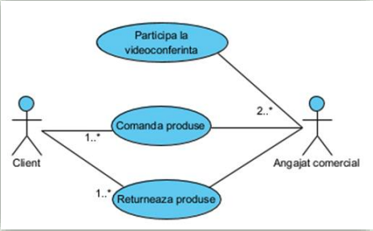
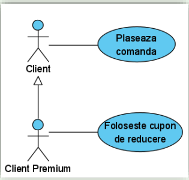
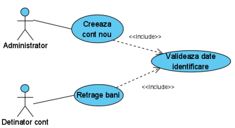
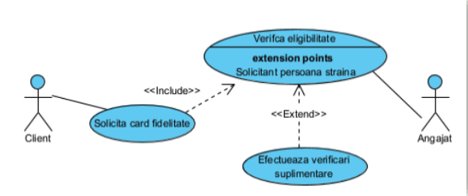

# Diagrama cazurilor de utilizare

- Reprezinta graficu functionalitatile pe care trebuie sa le indeplineasca sistemul informatic

- **Model al cerintelor** reprezinta descriere textuala a fiecarui caz de utilizare

- Diagrama cazurilor de utilizare este formata din _actori, cazuri de utilizare si relatie dintre ele_

## Actori

- Persoane sau sisteme informatice care interactioneaza cu sistemul dezvoltat

- Reprezinta roluri care pot include factori umani, hardware extern sau alte sisteme

- O persoana poate juca mai multe roluri si un rol poate caracteriza mai multe persoane

- Un actor principal este un beneficiar direct al functionalitatilor oferite de sistem

- Un actor secundar are rolul de oferi servicii sistemului

- Actorul raspunde la intrebarea _cine_ (cine solicita date din sistem?, cine modifica date din sistem?, etc.)

## Cazuri de utilizare

- Modeleaza un "dialog" intre un actor si sistemul informatic

- Are un scop: arata ceea ce sistemul trebuie sa faca

- Numele unui caz de utilizare desemneaza o actiune si trebuie sa includa un verb

- Sunt neutre dpdv tehnologic

- **Multimea cazurilor de utilizare reprezinta toate modalitatile in care sistemul poate fi folosit**

## Relatii intre actori si cazuri de utilizare

- Sunt folosite asocierile simple pentru a conecta un actor de un caz de utilizare

- Reprezinta o cale de comunicare intre cei doi

- Sunt permise multiplicitati



**OBS:** Un client poate comanda unul sau mai multe produse. Un client returneaza unul sau mai multe produse. La o videoconferinta participa 2 sau mai multi angajati comerciali

## Relatii intre actori

1. Generalizarea / specializarea

- Copilul mosteneste proprietatile actorului parinte



- Un client premium este un client normal, dar poate sa foloseasca si un cupon de reducere

## Relatia de includere

**OBS:** Intre doua cazuri de utilizare care se refera la acelasi sistem nu pot exista relatii simple

- Includerea are ca scop integrarea unui caz de utilizare in alt caz de utilizare, primul devenind astfel o parte logica din acel caz de utilizare



- Creeaza unui cont nou presupune validarea datelor de identificare inainte. Retragerea banilor presupune validarea datelor de identificare inainte

## Relatia de extindere

- Are loc doar in anumite conditii pe baza alegerii unui actor

- Cazul de utilizare extins este complet independent



- Solicitarea unui card de fidelitate presupune verificarea eligibilitatii (includere). Daca solicitantul este o persoana straina, se efectueaza verificari suplimentare (extinderea)

- Sageata de extend arata actiunea unde avem if-ul. if persoana este straina la verificarea eligibilitatii, atunci efectuam verificari suplimentare

## Generalizarea

- Se foloseste cand doua sau mai multe cazuri de utilizare au in comun comportament, structura si scop

**EX:**

```txt
            Plasarea comenzii
            ↑               ↑       // Generalizare
            |               |
            |               |
            |               |
            |               |
          Comanda       Comanda prin            // Caz de utilizare
         telefonica       internet
            |               |
            |               |
            |               |
          Client          Client                // Actori
         telefonic        internet
```
