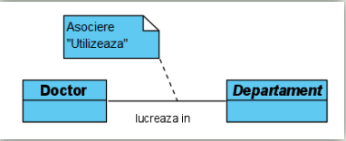
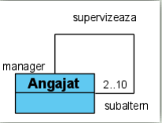
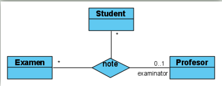
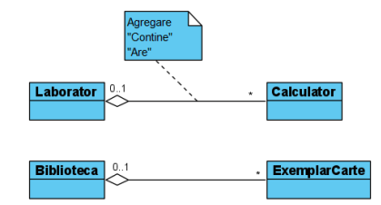
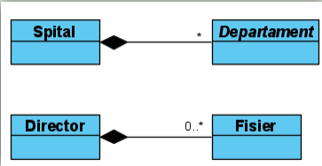

# Diagrama de clase

## Clasa

- Ansamblu de obiecte care au aceleasi caracteristici si constrangeri

- Caracteristicile sunt atributele si operatiile clasei

- Clasele abstracte nu pot fi instantiate. Rolul lor este de a permite altor clase sa le mosteneasca

- O interfata descrie un set de caracteristici si obligatii publice, speficifica un **contract**. Orice instanta care implementeaza interfata trebuie sa ofere serviciile furnizate prin contract

## Atributele

- Publice (vazute si folosite de oricine) +

- Private (numai clasa insasi poate avea acces) -

- Protected (clasa si subclasele au acces) #

- Package (numai clasele din acelasi pachet au acces) ~

## Operatii

- Forma generala:

<code>[vizibilitate] nume ([directie] lista de parametrii) [:tip returnat] [{proprietate}]</code>

- Aceleasi simboluri de vizibilitate ca la clase

## Exemple

1. Exemple de atribute:

```uml
- varsta: Integer {varsta > 18}     // varsta trebuie sa fie mai mare de 18 ani
# nume:String[1..2]="Ioana"        // pot avea 1 sau 2 nume, default Ioana
~ Id:String {unique}
/ sumaTotoal:Real=0
```

2. Exemple de operatii:

```uml
+ setVarsta(out: varsta:Integer)
+ getVarsta(in Id:String):Integer {query}
- schimbaNumele(inout nume:String)
```

## Relatia de asociere

- Implica stabilirea unei relatii intre clase

- Pot fi clasificare ca utilizari



- Doctorul lucreaza intr-un departament

- **Asocierile sunt**

1. Unare (reflexive)

- Cand pot fi asociate obiecte din acceasi clasa



2. Binare

- Intre doua clase

3. N-are

- In 3 sau mai multe clase

- Apar atunci cand mai mult de doua obiecte sunt implicate intr-o relatie



- Un student sustine un examen fara profesor sau cu exact un profesor

- Un examen cu un profesor poate fi sustinut de orice numar de studenti

- Un student poate fi notat de un profesor pentru orice numar de examene

- Nu este posibil ca doi sau mai multi profesori sa noteze un student la acelasi examen

## Clasa modelata ca asociere

- Utilizata pentru a surprinde anumite caracteristici ale unei asociere intre doua clase

- Nu apartine claselor asociate, ci apartin relatiei dintre clase

- Ex: Relatia dintre Student si Curs este modelata de inscriere

## Relatia de agregare

- Semnificatie: "Este format din ...", "Contine ...". "Are ..."

- Agregarea este partajata sau compusa

### Agregarea partajata

- Forma slaba de agregare

- Daca clasa intreg se sterge, clasa parte va mai exista in continuare



- Laboratorul contine Calculator. Biblioteca are Exemplar Carte

### Agregarea compusa

- Daca clasa parinte se sterge, clasa parte se sterge si ea



## Relatia de generalizare

- Clasa de nivel superior - inferior

- Relatia: "este un tip de" sau "este un"

- Exemplu: Departament in spital si clasele Chirurgie, Dermatologie si Stomatologie
