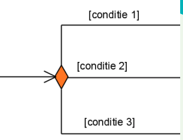
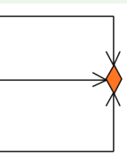
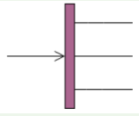
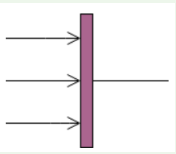
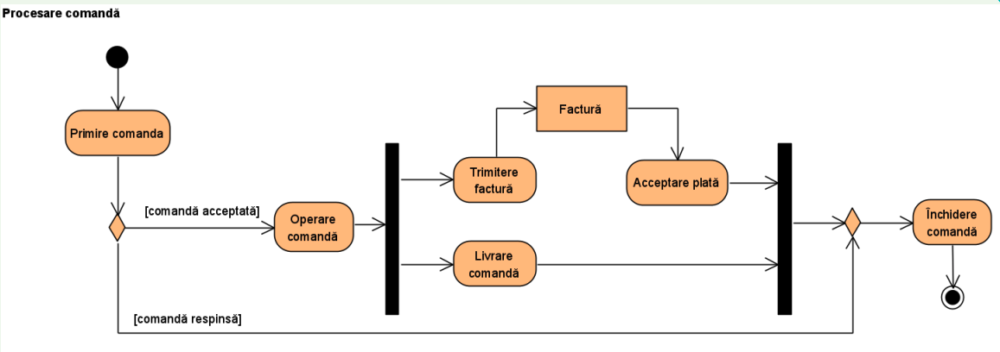
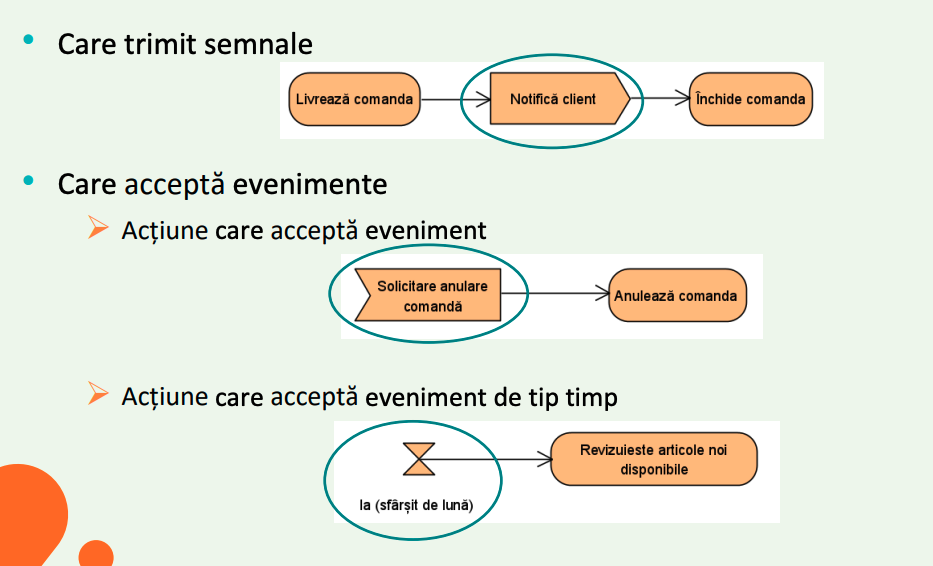
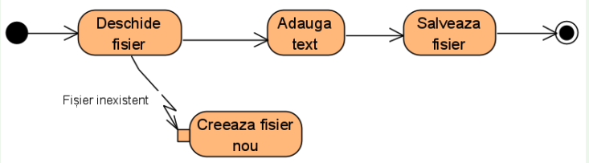
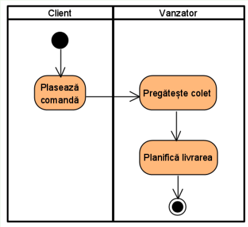

# Diagrama de activitate

- Ajuta la reprezentarea vizuala a secventelor de actiuni prin care se doreste obtinerea unui rezultat

- Se poate realiza pentru unul sau mai multe cazuri de utilizare sau pentru descrierea de operatii complexe

## Activitatea

- Un comportament parametrizat reprezentat sub forma unui flux coordonat de actiuni

- Specifica comportamentul definit de utilizator la diferite niveluri de granualitate

- **Activitatea este un graf directionat**

## Actiune

- Reprezinta un singur pas in cadrul unei activitati

- Actiunile sunt atomice (nu pot sa fie descompuse)

## Constrangeri

- Pot fi atasate unei actiuni sub forma unor pre si post conditii

- Se foloseste adnotarea <<precondition>> sau <<postcondition>>

## Fluxuri

- Conecteaza intre ele activitatile si actiunile

1. Arc flux de control - un arc pe diagrama care descrie modul de transfer al contrului de la o actiune la alta

```txt
                        [comanda valita]
Completeaza Comanda -----------------------------> Proceseaza Comanda
```

- Comanda valida este o conditie

- Sageata este un flux

2. Arc flux de obiecte - un flux de-a lungul caruita sunt transferate obiecte sau date

```txt
                  Comanda                          Comanda
Completeaza Comanda |-|---------------------------->| | Proceseaza Comanda
```

- Se transmite o comanda si ne sumeste flux de obiecte

## Jetoane

- Mecanism virtual de coordonare care descrie cu exactitate executia

- Nu este inclus in notatiile diagramei

- Un mecanism care acorda actiunilor permisiunea de executie

- **Mecanism:** Daca o actiune primeste un jeton, atunci actiunea poate fi executata. Cand actiunea este finalizata, aceasta transmite jetonul urmatoarei actiuni.

- Avem 2 tipuri de jetoane:

1. Jeton control

- permisiune de executie pentru un nod

2. Jeton obiect:

- transport de date + permisiune de executie

## Noduri

1. Noduri decizionale

- Intra un flux si ies mai multe

- Fluxurile de iesire trebuie sa fie insotite de conditii mutual exclusive

- Jetonul alege o singura cale



2. Noduri de imbinare

- Nod in care intra mai multe fluxuri si iese unul singur

- Transmite jetonul urmatorului nod



3. Nod de bifurcatie (fork)

- Nod in care intra un singur flux si ies mai multe

- Denota inceputul unor actiuni paralele

- Se creeaza copii ale jetoanelor pentru toate arcele de iesire



4. Nod de sincronizare (join)

- Nod in care intra mai multe fluxuri si iese doar unul singur

- Toate fluxurile care intra in sincronizare trebuie sa ajunga in punctul de sincronizare inainte ca procesarea procesarea sa continue

- Denota sfarsitul unei procesari paralele



## Exemplu:



## Actiuni bazate pe evenimente



## Tratarea exceptiilor

- Handler-ul de exceptii inlocuieste actiunea in locul de unde a aparut eroarea



- Daca marcam ca eveniment anularea comenzii, o conectam cu exceptia Anuleaza Comanda. Blocul eveniment Solicitare anulare comanda este un bloc independent

## Partitii

- Coloanele care arata cine sau ce executa actiunile intr-o diagrama de activitate

- Pot sa fie verticale sau orizontale

- Separarea pe partitii poate fi facuta in functie de unitatile organizationale, responsabilitati, etc.


