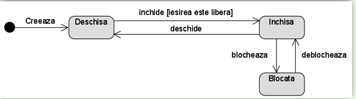

# Diagrama de masina cu stari

- Modeleaza starea dinamica a unui obiect specific

- **Starea** reprezinta o perioada sau o situatie din existenta unui obiect care satisface in acel moment anumite conditii, efectueaza anumite activitati sau asteapta anumite evenimente

- Evenimentele determina tranzitia unui obiect dintr-o stare in alta

## Stari

- Starea este reprezentata ca un dreptunghi

- Starea compusa este o stare care contina substari

- Stare submasina - folosita pentru a reutiliza o parte a unei digrame stari in alte diagrame de stari

1. Starea initiala

- Pseudostare (obiectul nu poate ramane in acea stare)

- Semnifica inceputul vietii unui obiect

2. Stare finala

- Stare reala

- Obiectul poate ramane in starea finala pentru totdeauna

3. Nod de terminare (X)

- Pseudostare

- Termina masina de stari

- Executia se termina imediat fara a executa activitati de iesire

## Tranzitii

- Obiectul tranziteaza dintr-o stare in alta cand apare un eveniment si cand sunt indeplinite anumite conditii

- Tranzitia este reprezentata ca o sageata de la o stare existenta catre o stare de intrare / tinta

- Tranzitia poate contine:

1. Declansator (cauza tranzitiei care poate fi un eveniment, o schimbare intr-o conditie)

2. Conditie

3. Efect

## Activitati

- Cu exceptia starii initiale si a celei finale, fiecare stare are un nume, atributele proprii unei stari, actiunile si activitatile efectuate

- Avem mai multe actiuni speciale ce pot sa fie incluse:

1. Entry

- actiune efectuata la intrarea intr-o stare

2. Exit

- actiune efectuata la iesirea dintr-o stare

3. Do

- actiune efectuata pe parcursul unei stari

- evenimentele externe pot fi intrerupte de actiunile Do

4. Defferable trigger

- eveniment intern care nu declanseaza o tranzitie la alta stare

## Decizia

- Este o pseudostare care realizeaza o bifurcatie conditionala

- Evalueaza conditiile declansatorilor tranzitiilor de iesire pentru a alege o singura tranzitie de iesire

- In coltul din dreapta jos avem si stare compusa

## Aprofundare

- **Imaginea 1:** Tranziția din starea „participă la curs” în „timp liber” are loc automat după 90 de minute. Nu există o condiție explicită verificată; timpul doar trece.

- **Imaginea 2:** Tranziția din starea „participă la curs” în „timp liber” are loc doar dacă cursul s-a terminat si se verifică explicit condiția că timpul scurs este de cel puțin 90 de minute (adică [timp >= 90 min]).

- In imaginea 1, dupa(90 min) este o conditie directa, fara verificare explicita

- In imaginea 2, „cursul s-a încheiat [timp >= 90 min]” reprezintă o condiție explicită care trebuie verificată înainte de a face tranziția către „timp liber”.

- In imaginea 2, conditia NU este verificata permanent. Condiția din imaginea (2) este verificată doar la momentul încheierii cursului.Condiția este verificată la momentul specific din diagramă.
