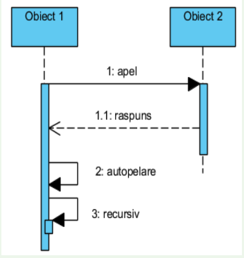

# Diagrama de interactiune

- Modeleaza aspectele dinamice ale sistemului

- Este de 2 tipuri: de secventa si de comunicare

## Diagrama de secventa

- Este o diagrama de interactiune formata din obiecte, mesaje care se schimba intre obiecte si dimensiune temporala (axa verticala)

- Sublineaza ordinea mesajelor in functie de timp

- Obiectele sunt plasate in marginea de sus a diagramei, pe orizontala

### Obiectele

- Linia de viata a obiectelor este linia verticala care reprezinta existenta unui obiect de-a lungul perioadei de timp. PS: Unele obiecte pot avea o durata de viata mai mica, dar majoritatea au durata de viata cat toata diagrama

- Specificarea executiei: un dreptunghi inalt si subtire care indica perioada de timp in care obiectul realizeaza o actiune

### Mesajele

- Sunt reprezentate sub forma unor arcuri

- Pornesc de la linia de viata a unui obiect si se opresc la linia de viata a altui obiect

- Pot include **parametrii**

1. Mesaj de tip apel (call)

- Reprezinta un mesaj sincron

- Obiectul care trimite mesajul asteapta raspunsul

2. Mesaj de tip raspuns (return)

- Poate fi omis daca continutul si locul sunt evidente

3. Mesaj asincron

- Emitatorul isi continua activitatea fara sa astepte raspuns

4. Autoapelarea

- Un obiect poate trimite mesaje si catre sine.

- Exemplu: Apelul recursiv al unei operatii sau o metoda care apeleaza alta metoda a aceluiasi obiect.

5. Mesaje de crearea / distrugere

- Sunt optionale

- Mesajul de distrugere poate crea distrugeri ulterioare ale unor obiecte pe care acesta le contine prin compunere.

- Dupa distrugere un obiect nu poate fi creat din nou pe aceeasi linie de viata

### Ordinea executarii mesajelor

### Exemplu diagrama

### Fragmente combinate

- Diagramele de secventa nu sunt folosite pentru a reprezenta logica procedurala complexa. Pentru a face acest lucru se implementeaza fragmente combinate

- **Un fragment combinat** reprezinta una sau mai multe secvente de procesare incluse intr-un cadru si executate in anumite circumstante

## Diagrama de colaborare (comunicare)

- Diagrama de interactiune care sublinieaza organizarea structurala a obiectelor care trimit si primesc mesaje

- Grafic, este o colectie de varfuri si arce. Obiectele sunt plasate prinele, ca varfuri ale unui graf, se traseaza legaturile care conecteaza obiecte, ca arcuri in acest graf si ulterior se ataseaza mesajele

## Aprofundam

- **Pentru mesajul de tip gasit** emitatorul este necunoscut sau irelevant. Mesajul apare in sistem fara a se cunoaste emitatorul. Aceste mesaje sunt utilizate pentru a indica o interacțiune inițiată din afara sistemului sau dintr-un context care nu este important pentru modelarea curentă.
