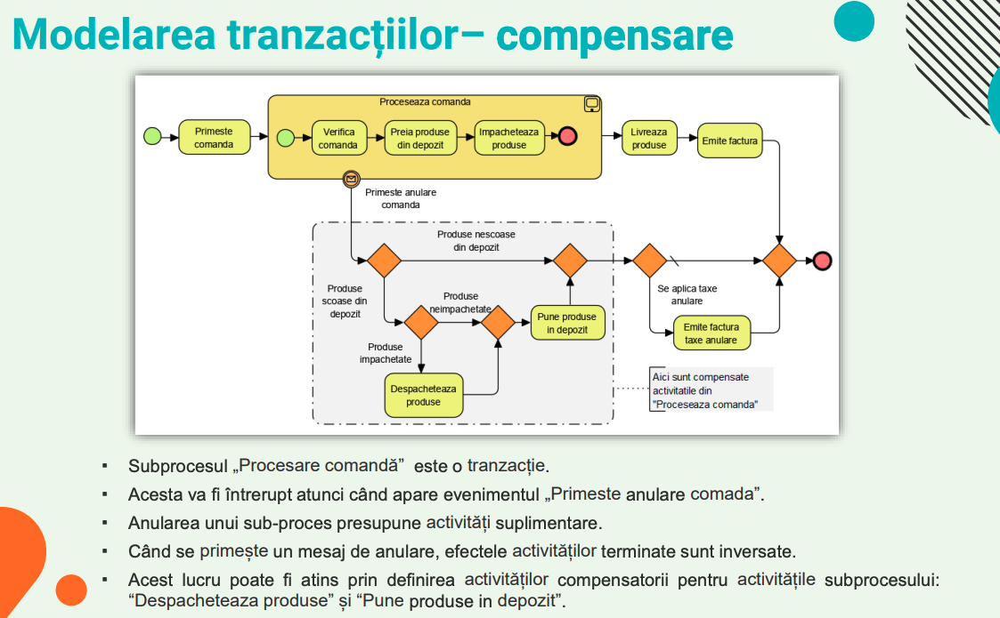
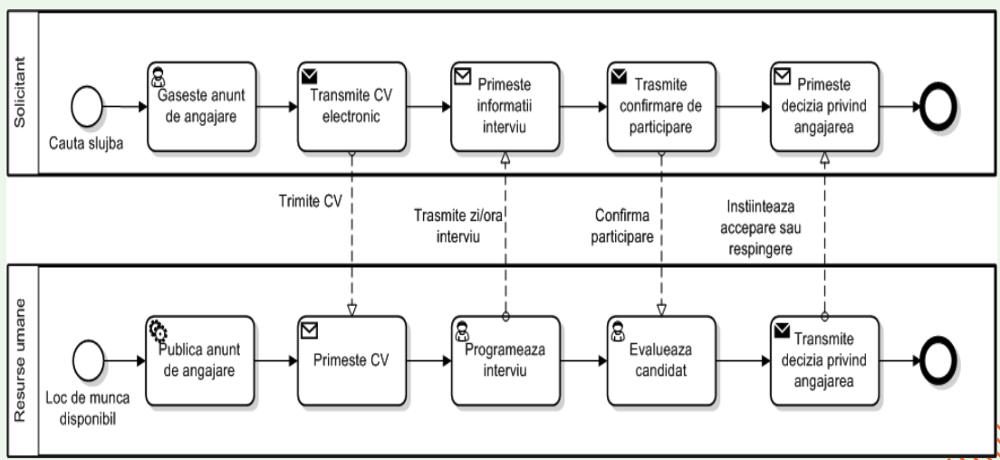
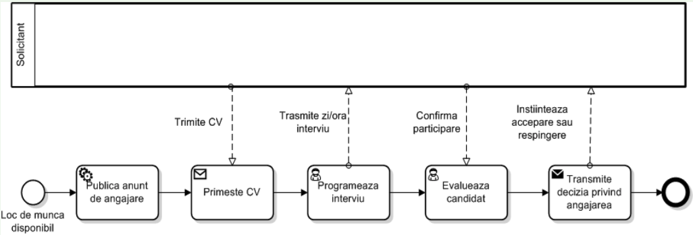

# Limbajul BPMN (2)

## Modelarea tranzactiilor

- Tranzactiile sunt intotdeauna unitati complete de lucru

- Tranzactia este efectuata complet sau deloc

## Diagrama de colaborare

- O colaborare este o interactiune sincronizata a doua sau mai multe procese

- O astfel de interactiune se numeste "coregrafie"

- Diagramele de colaborare sunt utile in special pentru documentarea cooperarii mai multor companii

- Exemplu diagrama de colaborare

- Solicitantul este rol partener

- Recrutare angajat este numele procesului

**OBS:**

1.  Fluxurile de mesaje sunt permise numai intre containere diferite (liniile punctate)

2.  Fluxurile de secventa nu pot conecta activitati ce apartin unor procese diferite, doar in cadrul aceluiasi container (liniile neintrerupte)

## Cutia neagra

- Se pot modela colaborari pentru care se specifica doar containerul care ii reprezinta, nu si procesul desfasurat la nivelul acestuia

