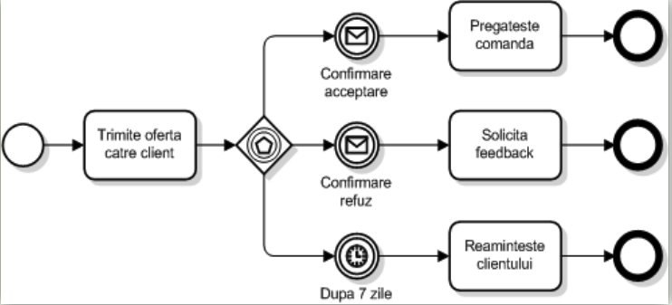

# Limbajul BPMN (1)

- Standard creat de OMG, similar UML

- Modelele BPMN pot fi create in scopul identificarii, validarii, imbunatatirii sau automatizarii proceselor

- Permit optimizarea proceselor din lumea reala, prin simulare

## Elemente de baza

## Actiuni

- Sunt obiecte de flux

## Evenimente

## Exemplu

## Porti exclusive

## Porti inclusive si paralele

## Porti complexe

## Porti pe baza de evenimente

## Diagrama de colaborare

- Sunt reprezentate comunicatiile dintre doua componente prin mesaje

## Aprofundam

1. Tipuri de divergenta

- Poarta din diagramă este reprezentată printr-un romb cu condiții atașate fiecărui flux.

- Condițiile („Homepage selectată”, „Ziar selectat”, „Portal job-ri selectat”) indică faptul că doar unul dintre fluxuri va fi ales în funcție de condiția evaluată ca adevărată.

- In acest caz avem **divergenta exclusiva**

- Toate activitățile („Publică postare intern” și „Publică postare extern”) vor fi executate simultan.

- In acest caz avem **divergenta paralela**
